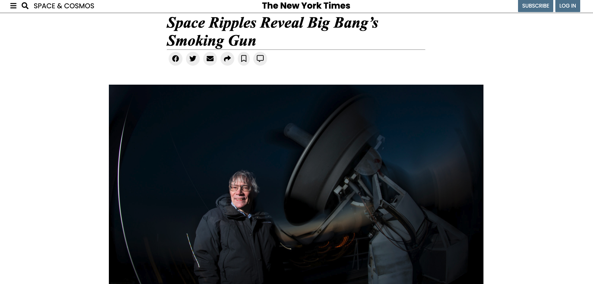

# New York Time Clone

>A clone version of The new york times website, well structured and styled to look exactly like the original

## Built With

- HTML
- CSS
- Flex-box

## LIVE DEMO

### Prerequisites

- Text Editor
- internet brower
- live sever

### Setup

- clone to local storage

### Install

- No instalation required!

## Authors

👤 **Author1**

- GitHub: [@githubhandle](https://github.com/juxsalley)

👤 **Author2**

- GitHub: [@githubhandle](https://github.com/Bishoy-Samwel)

## 📝 License

This project is [MIT](lic.url) licensed.
